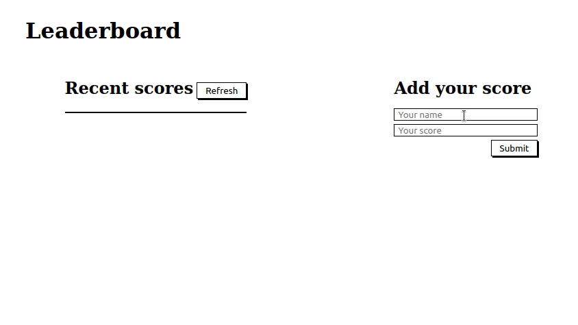

# Leaderboard

> The leaderboard website displays scores submitted by different players. It also allows you to submit your score. It preserves all data thanks to the external Leaderboard API service.

Below you can see how this website should look and behave:



## Setup

### Clone this repository

```bash
$ git clone git@github.com:Sahar-AbdelSamad/Leaderboard.git
$ cd Leaderboard
```

### Run project

```bash
$ npm install
$ npm run start # this will make webpack watching for your changes in code
```

### Open page in browser

```bash
$ open dist/index.html
```

## Built With

- HTML
- JavaScript
- CSS
- Webpack

## Authors

👤 **Sahar Abdel Samad**

- GitHub: [@sahar-abdelsamad](https://github.com/Sahar-AbdelSamad)
- Twitter: [@abdelsamadsahar](https://twitter.com/AbdelSamadSahar)
- LinkedIn: [abdel-samad-sahar](https://www.linkedin.com/in/abdel-samad-sahar-353977223/)

## 🤝 Contributing

Contributions, issues, and feature requests are welcome!

Feel free to check the [issues page](https://github.com/Sahar-AbdelSamad/Leaderboard/issues).

## Show your support

Give a ⭐️ if you like this project!
